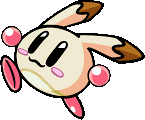
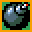
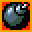
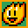
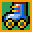
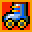

<p align="center">
    
</p>

# moulmerman
###### 물merman

# Storyline
You are in a city after a mysterious virus kill almost all humans.
You and your new friends build a camp to survive but your new life
is very annoying, so you tried to find a good game to kill the time. </br>
Luckily you found a game: Bomberman.

# How to play
You can play up to 4 player or AI define the type of the player
in Selection Menu, you can also change the name of the players.
In the game play with these keys:
### Player 1
* Forward `Z`
* BackWard `S`
* Left `Q`
* Right `D`
* Bomb `A`
### Player 2
* Forward `T`
* BackWard `G`
* Left `F`
* Right `H`
* Bomb `Y`
### Player 3
* Forward `I`
* BackWard `K`
* Left `J`
* Right `L`
* Bomb `O`
### Player 4
* Forward `ARROW_UP`
* BackWard `ARROW_DOWN`
* Left `ARROW_LEFT`
* Right `ARROW_RIGHT`
* Bomb `Enter`

## Bonus
### Bomb
<p>
    
    
</p>
Bonus bomb give you one bomb, 
it can also remove one bomb if you get the devil bonus. </br>
Maximum of bomb is 10 and the minimum is 1.

### Range
<p>
    
    
</p>
Bonus range increase your range by one, 
it can also decrease your range if you get the devil bonus. </br>
Maximum range is 5 and the minimum is 1.

### Speed
<p>
    
    
</p>
Bonus range increase your speed by one, 
it can also decrease your speed if you get the devil bonus. </br>
Maximum range is 7 and the minimum is 2.

### Ninja
<p>
    
</p>
The ninja bonus allow you for 5 seconds to pass through all destroyable
block of the map. After 5 seconds you will get teleported to your original location. </br>
WARNING: The fire can kill a ninja.

# How to build the project
You can download the compiled project in [Release](https://github.com/Alvarwow69/moulmerman/releases) section </br>
If you can to build the project follow these steps:
* Download the [ShipWreck Engine](http://api.creative-rift.com/download_sw/libs?platform=windows&v=alpha-0.3-beta_12.rar)
* Unzip the file and put the folder libraries at the root of the repo
* Execute these command
```bash
mkdir build ; cd build
cmake -G "Visual Studio 17 2022" -DCMAKE_BUILD_TYPE=[Debug/Release] ..
cmake --build . --target Moulmerman --config [Debug/Release]
```
* Copy folder `resources` and file `Config.yml` into `out/[Release/Debug]`
* Run the game and enjoy your game